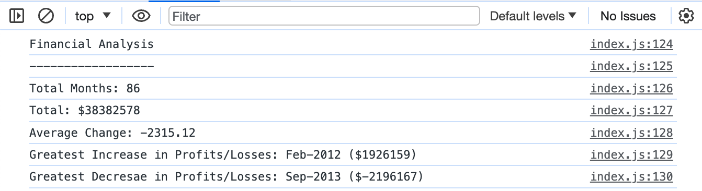
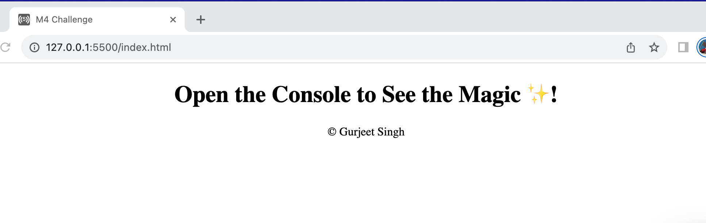

# Console-Finances
Analyzing the financial records of a company. 

- **Visit** the deployed webapp at : 

## Table of Contents

1. [Introduction](#introduction)
2. [Screenshots](#screenshots)

## Introduction
    
**Purpose:** Aanalyzing the financial records of a company. 

The website analyses the records to calculate each of the following:

- The total number of months included in the dataset.

- The net total amount of Profit/Losses over the entire period.

- The average of the changes in Profit/Losses over the entire period.

- The greatest increase in Profit/Losses (date and amount) over the entire period.

- The greatest decrease in Profit/Losses (date and amount) over the entire period.

## Screenshots
- **Console Results**:

- **Index Page**:

